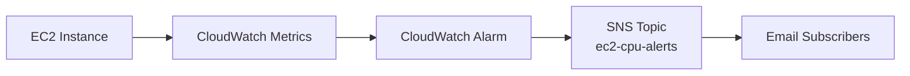

# Architecture — EC2 CPU Alert

**Goal:** Notify (email) when an EC2 instance's CPU utilization stays above a threshold for a sustained period.

## Diagram (mermaid)


## ASCII diagram
```
[EC2 Instance] --> [CloudWatch Metric: CPUUtilization]
                      |
                      v
               [CloudWatch Alarm]
                      |
                      v
               [SNS Topic: ec2-cpu-alerts]
                      |
                      v
                 [Email Subscriber]
```

## Notes & extensions
- Default CPU metric (AWS/EC2 CPUUtilization) is available without the CloudWatch Agent.
- For memory/disk metrics, install & configure the CloudWatch Agent.
- Extensions:
  - Lambda subscribed to SNS for custom automation (auto-scale, remediation)
  - EventBridge rules for advanced routing
  - PagerDuty/SMS integrations for on-call notifications